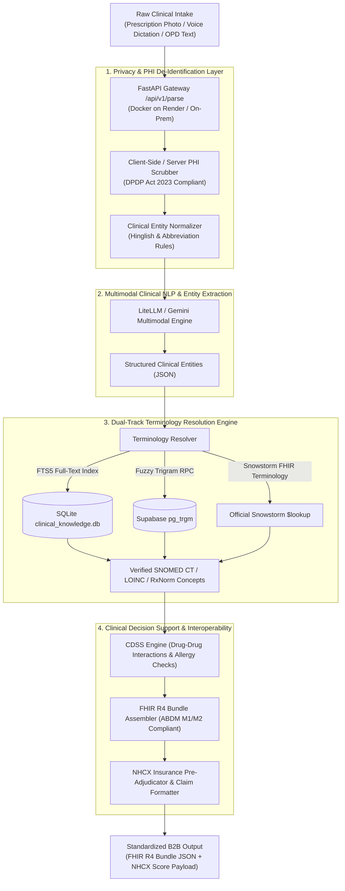

# SICCE: SNOMED-India Clinical Coding Engine & ABDM/FHIR Middleware

[](https://www.python.org/)
[](https://fastapi.tiangolo.com/)
[](https://hl7.org/fhir/R4/)
[](https://www.snomed.org/)
[](https://abdm.gov.in/)
[](https://nhcx.abdm.gov.in/)
[](LICENSE)
[](tests/)

> **A high-throughput, privacy-first Clinical NLP and Terminology Resolution Gateway** bridging unstructured point-of-care clinical documentation (prescriptions, voice dictation, and medical notes) into validated, semantically coded **HL7 FHIR R4 Bundles** and **NHCX Insurance Claim Payloads**.

---

## 🌐 Live Production Deployments & Documentation

| Environment | Endpoint URL | Description |
| :--- | :--- | :--- |
| **Live Web Platform** | [https://snomed-ct-parser-1.onrender.com/](https://snomed-ct-parser-1.onrender.com/) | Interactive prescription parser demo, live visualizer, and clinical workbench |
| **Developer Workbench** | [https://snomed-ct-parser-1.onrender.com/workbench.html](https://snomed-ct-parser-1.onrender.com/workbench.html) | High-volume developer workbench with live FHIR R4 JSON inspect & copy-as-cURL |
| **Interactive OpenAPI Docs** | [https://snomed-ct-parser-1.onrender.com/docs](https://snomed-ct-parser-1.onrender.com/docs) | Swagger UI for exploring all REST endpoints, schemas, and health metrics |

---

## 🏥 Clinical Problem Statement

In outpatient departments across India and the Global South, physicians face extreme time constraints (often evaluating 60–100 patients per shift). Point-of-care documentation is characterized by:
1. **Multilingual & Vernacular Expressions (Hinglish/Regional Idioms)**: *"sar dard x 3 days"* (Headache), *"pet me marod"* (Abdominal Colic), *"loose motion x 2 days"* (Diarrhea).
2. **Non-Standard Clinical Abbreviations**: *"APD"* (Acid Peptic Disease), *"c/o"* (complaining of), *"AP+"* (Abdominal Pain Positive), *"B/L"* (Bilateral).
3. **Proprietary Pharmaceutical Brand Dominance**: Clinicians prescribe brand names (*Tab. Dolo 650*, *Syp. Ascoril LS*, *Cap. Pantocid DSR*) rather than active international generic molecules.

### The Interoperability Gap
Government mandates (**ABDM** in India, **EHDS** in the European Union) require structured, semantically coded data using **SNOMED CT, LOINC, and HL7 FHIR R4**. However, forcing physicians to manually search a 350,000-concept hierarchy destroys clinical throughput.

**SICCE** solves this by acting as an automated, non-invasive **middleware translation layer**: doctors continue writing or dictating natural clinical notes, while SICCE converts them into rigorous, standardized FHIR R4 payloads and pre-adjudicated claim files in real time.

---

## 🏗️ Architecture & Pipeline Overview



---

## ⚡ Key Technical Innovations

### 1. Dual-Track Terminology Normalization
Direct generic conversion can obscure clinician intent. SICCE implements a dual-track mapping:
- **Prescribed Form**: Retains the prescribed brand name (*"Tab. Dolo 650"*), dosage form (*Tablet*), and strength (*650mg*).
- **Active Clinical Molecule**: Resolves the true active pharmaceutical ingredient to international SNOMED CT (`387517004 | Acetaminophen |`), RxNorm, and equivalent Jan Aushadhi (PMBJP) generic formulations.

### 2. ABDM Milestone 1 & 2 Interoperability
- **M1 (ABHA Creation & Auth)**: Verification pipeline for Aadhaar OTP, Mobile OTP, and demographic matching.
- **M2 (Care Context Linking)**: Generates compliant `OPConsultation` and `DischargeSummary` FHIR bundles conforming to the NRCeS India profiles.

### 3. NHCX Automated Pre-Adjudication Engine
- Automatically parses clinical diagnoses against IRDAI guidelines and TPA adjudication logic.
- Evaluates claim readiness before submission with a **Pre-Submission Approval Score (0–100%)**, flagging missing clinical justifications, non-covered diagnoses, or ICD/SNOMED mismatches.

### 4. Zero Code Hallucination Policy (Law #1)
- Unlike generic generative LLMs that may hallucinate fictional medical codes, SICCE strictly enforces **Law #1**: *Every single returned terminology code must be verified against an authentic SNOMED CT / LOINC database index*. Unresolved terms are transparently labeled as `uncoded: true` with a fallback to raw text rather than synthesizing false identifiers.

### 5. Privacy-by-Design & DPDP Act 2023 Compliance
- **Client-Side PHI Scrubbing**: Client-side regex engine redacts patient names, phone numbers, and IDs before transit.
- **Section 12 Ephemeral Purge**: Automatic zero-retention memory purge post-transformation.
- **Offline Air-Gapped Appliance**: Complete Docker compose configuration (`docker-compose.enterprise.yml`) for running within isolated hospital LANs.

---

## 📁 Repository Structure

```text
snomed-ct/
├── abha_gateway.py               # ABDM M1/M2 ABHA verification & Care Context gateway
├── auth_service.py               # Argon2id authentication & API key management
├── build_clinical_db.py          # SQLite FTS5 database builder & seed compiler
├── cdss_engine.py                # Clinical Decision Support (DDI & allergy cross-reactivity)
├── clinical_knowledge.db         # Fast SQLite FTS5 clinical terminology index
├── fhir_generator.py             # HL7 FHIR R4 Bundle generator (ABDM OPConsultation profile)
├── main.py                       # FastAPI application, routing, rate limiting, & endpoints
├── nhcx_adjudicator.py           # NHCX Pre-Adjudication engine (IRDAI / TPA scoring rules)
├── nhcx_claim_generator.py       # FHIR Claim resource bundle builder for insurance
├── nlp_parser.py                 # Clinical entity extraction, Hinglish & abbreviation rules
├── terminology_resolver.py       # Multi-backend SNOMED CT / LOINC / RxNorm resolver
├── vision_parser.py              # Multimodal OCR & prescription slip digitizer
├── voice_parser.py               # Clinical audio dictation ingestion pipeline
├── webhook_handler.py            # Authenticated webhook handler for clinical intake
├── data/
│   ├── formulary/                # PMBJP generic medicine formulary dataset
│   ├── refset/                   # Curated Outpatient (OPD) SNOMED reference sets
│   └── rf2/                      # Official SNOMED CT RF2 snapshot ingestion format
├── docs/                         # Architecture whitepapers, status reports, & setup guides
├── static/                       # Frontend web dashboard, interactive demo, & client scrubber
├── tests/                        # Comprehensive test suite (unit, integration, security)
│   ├── test_pipeline.py          # Core NLP, FHIR R4, and authentication tests
│   ├── test_production_suite.py  # ABDM M1/M2, NHCX, and clinical safety tests
│   ├── test_rf2_rehearsal.py     # RF2 snapshot ingestion verification
│   ├── test_security.py          # Argon2id hashing and access security tests
│   └── test_terminology_full.py  # SNOMED CT code collision and precision tests
├── Dockerfile                    # Container blueprint for cloud deployment
├── Dockerfile.onprem             # Container blueprint for offline air-gapped hospital LANs
├── docker-compose.enterprise.yml # Multi-container enterprise deployment stack
├── pyproject.toml                # Standard PEP 518 / PEP 621 Python package configuration
└── requirements.txt              # Production dependency specifications
```

---

## 🚀 Quickstart & Local Setup

### 1. Prerequisites
- Python 3.11+ or Python 3.12+
- `uv` (recommended) or standard `pip`
- Docker (optional, for containerized execution)

### 2. Installation

Clone the repository and install dependencies:

```bash
# Clone the repository
git clone https://github.com/safevoice009/snomed-ct.git
cd snomed-ct

# Create and activate virtual environment
python -m venv .venv
source .venv/bin/activate  # On Windows: .venv\Scripts\activate

# Install dependencies
pip install -r requirements.txt
```

### 3. Environment Configuration

Copy the example environment file:

```bash
cp .env.example .env
```

Configure your `.env` parameters:
```env
PORT=8000
API_KEYS="sicce_live_test_key_sample"
GEMINI_API_KEY="your-gemini-api-key"
ABDM_MODE="mock"  # or "sandbox"
```

### 4. Running the Local Server

```bash
uvicorn main:app --host 0.0.0.0 --port 8000 --reload
```

Access the interface at:
- **Interactive UI Demo**: [http://localhost:8000](http://localhost:8000)
- **API Swagger Documentation**: [http://localhost:8000/docs](http://localhost:8000/docs)
- **System Health Telemetry**: [http://localhost:8000/health](http://localhost:8000/health)

---

## 🧪 Automated Test Suite & Verification

The repository contains a 40-test automated verification suite covering unit functionality, terminology precision, clinical decision safety, and cryptographic security:

```bash
# Run the complete test suite
pytest tests/ -v
```

### Test Suite Coverage Summary:
- **FHIR R4 Bundle Validation**: Asserts 100% compliance with official ABDM `OPConsultation` schemas.
- **Terminology Resolution & Collision Prevention**: Asserts that no single SNOMED CT concept ID maps across distinct generic molecules.
- **Medication Safety & DDI Checks**: Validates critical drug-drug interaction flags (e.g., Warfarin + NSAIDs, Sildenafil + Nitrates).
- **Security & DPDP Purge**: Validates Argon2id password verification and ephemeral memory sanitization.

```text
======================= 40 passed, 0 failed in 13.37s =======================
```

---

## 🐳 Docker & On-Premises Deployment

### Standard Cloud Deployment
```bash
docker build -t sicce-gateway .
docker run -p 8000:8000 --env-file .env sicce-gateway
```

### Air-Gapped Enterprise Appliance
To run within an isolated hospital intranet:
```bash
docker-compose -f docker-compose.enterprise.yml up -d
```

---

## 📜 Ethical Stance & Compliance

- **Non-SaMD Status**: SICCE is an administrative and terminology translation middleware. It does not provide autonomous medical diagnostic determinations and is designed to operate under clinical human supervision.
- **DPDP Act 2023 Alignment**: Built with privacy-by-design principles, client-side zero-knowledge de-identification, and strict data minimization.
- **Open Standards**: Fully committed to open health data interoperability standards promoted by WHO, HL7, and SNOMED International.

---

## 📄 License & Attribution

Distributed under the **MIT License**. See [`LICENSE`](LICENSE) for more information.

Developed with clinical focus on global digital health interoperability, outpatient NLP standardization, and semantic coding.
