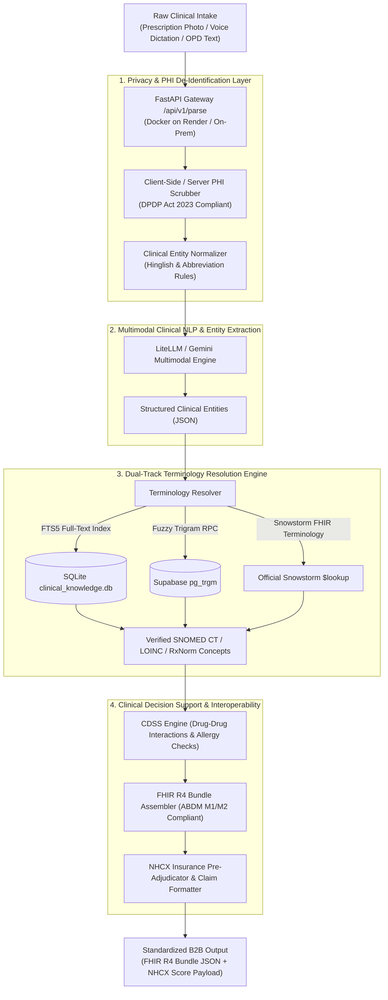

<div align="center">

# 🏥 SICCE: SNOMED-India Clinical Coding Engine & ABDM/FHIR Middleware

**A high-throughput, privacy-first Clinical NLP and Terminology Resolution Gateway bridging unstructured point-of-care clinical documentation into validated, semantically coded HL7 FHIR R4 Bundles and NHCX Insurance Claim Payloads.**

<br>

[](https://www.python.org/)
[](https://fastapi.tiangolo.com/)
[](https://hl7.org/fhir/R4/)
[](https://www.snomed.org/)
[](https://abdm.gov.in/)
[](https://nhcx.abdm.gov.in/)
[](https://github.com/safevoice009/snomed-ct/actions)
[](LICENSE)
[](tests/)

<br>

[🌐 **Live Web Platform**](https://snomed-ct-parser-1.onrender.com/) • 
[⚡ **Developer Workbench**](https://snomed-ct-parser-1.onrender.com/workbench.html) • 
[📖 **API Documentation (Swagger)**](https://snomed-ct-parser-1.onrender.com/docs) • 
[📄 **Architecture White Paper**](docs/SICCE_ARCHITECTURAL_WHITE_PAPER.md)

</div>

---

## 📑 Table of Contents
- [Clinical Problem Statement](#-clinical-problem-statement)
- [Interactive Demo & Translation Example](#-interactive-demo--translation-example)
- [Architecture & Pipeline](#-architecture--pipeline-overview)
- [Key Technical Innovations](#-key-technical-innovations)
- [Quickstart & Local Setup](#-quickstart--local-setup)
- [Live API Testing via cURL](#-live-api-testing-via-curl)
- [Automated Verification (40/40 Tests)](#-automated-test-suite--verification)
- [Enterprise & On-Premises Deployment](#-docker--on-premises-deployment)
- [Academic Citation & Attribution](#-academic-citation)

---

## 🏥 Clinical Problem Statement

In outpatient departments across India and the Global South, physicians face severe time constraints (evaluating 60–100 patients per shift). Point-of-care documentation is dominated by:
1. **Multilingual & Vernacular Expressions (Hinglish/Regional Idioms)**: *"sar dard x 3 days"* (Headache), *"pet me marod"* (Abdominal Colic), *"loose motion x 2 days"* (Diarrhea).
2. **Non-Standard Clinical Abbreviations**: *"APD"* (Acid Peptic Disease), *"c/o"* (complaining of), *"AP+"* (Abdominal Pain Positive), *"B/L"* (Bilateral).
3. **Proprietary Pharmaceutical Brand Dominance**: Clinicians prescribe brand names (*Tab. Dolo 650*, *Syp. Ascoril LS*, *Cap. Pantocid DSR*) rather than active international generic molecules.

### The Interoperability Gap
Government mandates (**ABDM** in India, **EHDS** in the European Union) require structured, semantically coded data using **SNOMED CT, LOINC, and HL7 FHIR R4**. However, forcing physicians to manually search a 350,000-concept hierarchy destroys clinical throughput.

**SICCE** solves this as an automated **middleware translation layer**: doctors continue writing or dictating natural clinical notes, while SICCE converts them into standardized FHIR R4 payloads and pre-adjudicated claim files in real time.

---

## 💡 Interactive Demo & Translation Example

### Input Clinical Narrative (Doctor's Note)
```text
Pt c/o sar dard x 3 days, pet me tez jalan x 2 days. No fever.
Rx:
1. Tab. Dolo 650mg 1-0-1 x 3 days
2. Cap. Pantocid 40mg 1-0-0 AC x 5 days
```

### SICCE Normalized Semantic Output
| Extracted Entity | Entity Type | Prescribed Form | Standardized Concept & Code | System |
| :--- | :--- | :--- | :--- | :--- |
| **sar dard** | Symptom | *Headache* | `25064002 \| Headache (finding) \|` | **SNOMED CT** |
| **jalan** | Symptom | *Pyrosis / Heartburn* | `16331000 \| Heartburn (finding) \|` | **SNOMED CT** |
| **Tab. Dolo 650** | Medication | *Dolo 650mg Tablet* | `387517004 \| Acetaminophen (substance) \|` | **SNOMED CT / RxNorm** |
| **Cap. Pantocid 40**| Medication | *Pantocid 40mg Capsule* | `108504000 \| Pantoprazole (substance) \|` | **SNOMED CT / PMBJP** |

<details>
<summary><b>🔍 View Synthesized ABDM HL7 FHIR R4 OPConsultation JSON (Click to expand)</b></summary>

```json
{
  "resourceType": "Bundle",
  "id": "sicce-bundle-example-001",
  "type": "document",
  "meta": {
    "profile": ["https://nrces.in/ndhm/fhir/r4/StructureDefinition/OPConsultRecord"]
  },
  "entry": [
    {
      "resource": {
        "resourceType": "Condition",
        "clinicalStatus": { "coding": [{ "system": "http://terminology.hl7.org/CodeSystem/condition-clinical", "code": "active" }] },
        "code": {
          "coding": [{ "system": "http://snomed.info/sct", "code": "25064002", "display": "Headache (finding)" }],
          "text": "sar dard"
        }
      }
    },
    {
      "resource": {
        "resourceType": "MedicationRequest",
        "status": "active",
        "intent": "order",
        "medicationCodeableConcept": {
          "coding": [{ "system": "http://snomed.info/sct", "code": "387517004", "display": "Acetaminophen (substance)" }],
          "text": "Tab. Dolo 650mg"
        },
        "dosageInstruction": [{ "text": "1-0-1 (twice daily)", "timing": { "repeat": { "frequency": 2, "period": 1, "periodUnit": "d" } } }]
      }
    }
  ]
}
```
</details>

---

## 🏗️ Architecture & Pipeline Overview



---

## ⚡ Key Technical Innovations

### 1. Dual-Track Terminology Normalization
Direct generic conversion destroys clinician intent. SICCE implements a dual-track mapping:
- **Prescribed Form**: Retains the prescribed brand name (*"Tab. Dolo 650"*), dosage form (*Tablet*), and strength (*650mg*).
- **Active Clinical Molecule**: Resolves the active pharmaceutical ingredient to international SNOMED CT (`387517004 | Acetaminophen |`), RxNorm, and equivalent Jan Aushadhi (PMBJP) generic formulations.

### 2. ABDM Milestone 1 & 2 Interoperability
- **M1 (ABHA Verification)**: Native cryptographic integration with the NHA ABHA Gateway for demographic and OTP verification.
- **M2 (Care Context Linking)**: Generates compliant `OPConsultation` and `DischargeSummary` FHIR bundles conforming to NRCeS India profiles.

### 3. NHCX Automated Pre-Adjudication Engine
- Evaluates claim readiness before submission with a **Pre-Submission Approval Score (0–100%)**, flagging missing clinical justifications, non-covered diagnoses, or ICD/SNOMED mismatches against IRDAI guidelines.

### 4. Zero Code Hallucination Policy (Law #1)
- Strictly enforces **Law #1**: *Every returned terminology code must be verified against an authentic SNOMED CT / LOINC index*. Unresolved terms are transparently labeled as `uncoded: true` with a fallback to raw text rather than synthesizing false identifiers.

### 5. Privacy-by-Design & DPDP Act 2023 Compliance
- **Client-Side PHI Scrubbing**: Client-side regex engine redacts patient names, phone numbers, and IDs before network transit.
- **Section 12 Ephemeral Purge**: Automatic zero-retention memory purge post-transformation.
- **Offline Air-Gapped Appliance**: Complete Docker compose configuration (`docker-compose.enterprise.yml`) for running within isolated hospital LANs.

---

## 💻 Live API Testing via cURL

Test the live production endpoint directly in your terminal:

```bash
curl -X POST "https://snomed-ct-parser-1.onrender.com/api/v1/parse" \
     -H "Content-Type: application/json" \
     -H "X-API-Key: sicce_live_-tLSpweWb8vrk0wjMqOQHwA9lc1yjsSwcY3eg6IZzic" \
     -d '{
       "text": "Pt c/o loose motion x 3 days, sar dard. Rx: Tab. Dolo 650mg BD x 3 days."
     }'
```

---

## 🚀 Quickstart & Local Setup

### 1. Installation
```bash
# Clone the repository
git clone https://github.com/safevoice009/snomed-ct.git
cd snomed-ct

# Create and activate virtual environment
python -m venv .venv
source .venv/bin/activate  # On Windows: .venv\Scripts\activate

# Install dependencies
pip install -r requirements.txt
```

### 2. Environment Configuration
```bash
cp .env.example .env
```

### 3. Running the Server
```bash
uvicorn main:app --host 0.0.0.0 --port 8000 --reload
```

---

## 🧪 Automated Test Suite & Verification

The repository contains a **40-test automated verification suite** covering unit functionality, terminology precision, clinical decision safety, and cryptographic security:

```bash
pytest tests/ -v
```

```text
======================= 40 passed, 0 failed in 8.51s =======================
```

---

## 🐳 Docker & On-Premises Deployment

### Cloud Container
```bash
docker build -t sicce-gateway .
docker run -p 8000:8000 --env-file .env sicce-gateway
```

### Air-Gapped Hospital LAN Stack
```bash
docker-compose -f docker-compose.enterprise.yml up -d
```

---

## 📚 Academic Citation

If you use SICCE or its terminology architectures in your research or digital health prototypes, please cite:

```bibtex
@software{sicce_clinical_engine_2026,
  author = {Baddam Sucharith Reddy},
  title = {SICCE: SNOMED-India Clinical Coding Engine & ABDM/FHIR Interoperability Gateway},
  year = {2026},
  publisher = {GitHub},
  journal = {GitHub repository},
  howpublished = {\url{https://github.com/safevoice009/snomed-ct}}
}
```

---

## 📄 License

Distributed under the **MIT License**. See [`LICENSE`](LICENSE) for details.
