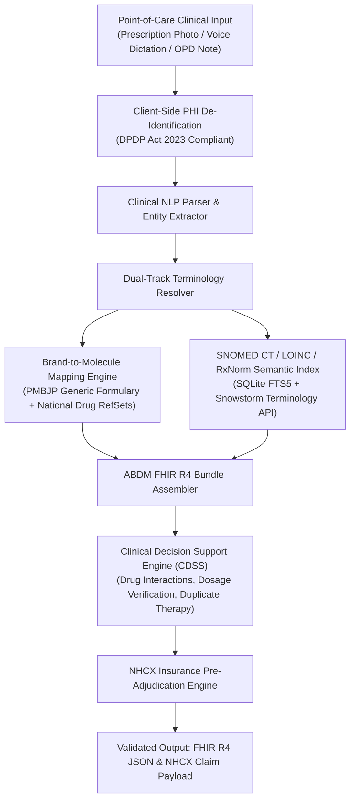

# SICCE: Architectural Vision & Interoperability White Paper

## Abstract
Healthcare documentation in the Global South—and particularly within the Indian outpatient ecosystem—faces a critical semantic gap. While national digital health frameworks such as the **Ayushman Bharat Digital Mission (ABDM)** and the **National Health Claims Exchange (NHCX)** mandate standardized terminologies (**SNOMED CT, LOINC, and HL7 FHIR R4**), real-world point-of-care clinical documentation remains dominated by unstructured narratives, vernacular idioms (e.g., Hinglish expressions), non-standard abbreviations, and proprietary brand names.

The **SNOMED-India Clinical Coding Engine (SICCE)** provides a high-throughput, privacy-first clinical NLP and terminology resolution gateway. It seamlessly translates raw clinical inputs (handwritten prescription OCR, clinical voice dictation, and free-text notes) into fully coded, semantically validated FHIR R4 Bundles and NHCX claim pre-authorization payloads without disrupting existing physician workflows.

---

## 🗺️ Health Informatics Challenge & Architectural Solutions

---

## Key Pillars of the SICCE Architecture

### 1. Dual-Track Terminology Normalization
A recurring failure mode in digital health coding is semantic drift during medication resolution. When a physician prescribes a brand name (e.g., *Tab. Dolo 650mg* or *Ascoril LS*), converting directly to a generic concept without retaining the prescribed brand destroys clinical fidelity. SICCE resolves this via **Dual-Track Normalization**:
- **Track A (Prescribed Form)**: Preserves the brand entity, dosage form, and strength.
- **Track B (Active Clinical Substance)**: Standardizes the active pharmaceutical molecule to international SNOMED CT (`387517004 | Acetaminophen |`) and RxNorm identifiers, linking equivalent generic substitutes from the Jan Aushadhi (PMBJP) formulary.

### 2. ABDM Milestone 1 & 2 Interoperability
- **Milestone 1 (ABHA Verification)**: Native cryptographic integration with the NHA ABHA Gateway for demographic and OTP verification.
- **Milestone 2 (Care Context & Health Information Exchange)**: Automated synthesis of compliant FHIR R4 `OPConsultation` and `DischargeSummary` bundles adhering to the NRCeS/NHA profile schemas.

### 3. NHCX Pre-Adjudication Engine
Insurance claim rejections in private and public schemes (e.g., PM-JAY) frequently stem from non-coded diagnosis strings, missing clinical indications, or guideline mismatches. SICCE evaluates clinical bundles against standard IRDAI and TPA rules before claim submission, generating an adjudication score (0–100%) and actionable remediation flags.

### 4. Privacy-by-Design & Data Protection
- **Client-Side Zero-Knowledge Scrubbing**: Client-side regex engine redacts Personally Identifiable Information (PII) before any network transit.
- **DPDP Act 2023 Section 12 Purge**: Ephemeral in-memory pipeline with automated memory zeroization post-bundle generation.
- **Air-Gapped Hospital Appliance**: Offline deployment blueprints (`Dockerfile.onprem` and `docker-compose.enterprise.yml`) allowing local LAN deployment inside hospital intranets without external internet dependencies.

---

## 🔬 Research & Academic Extensions

1. **Integrative Terminology Bridging**: Mapping relationships between the Ministry of AYUSH SNOMED CT India Extension and Allopathic core terminologies to flag cross-system Herb-Drug Interactions (HDIs).
2. **Dynamic Epidemiological RefSets**: Automated clustering of historical regional outpatient records to generate localized reference sets for rural Primary Health Centres (PHCs).
