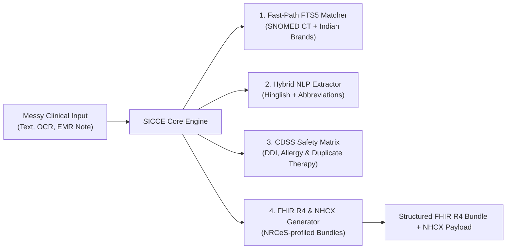

# SICCE: ABDM & NHCX Compliance Engine in a Box
### Clinical Translation & Pre-Adjudication Middleware for Indian Healthcare Systems

> **Every number in this document is verified and dated.** SICCE's core promise to partners is *measured accuracy and zero fabricated data* — we hold our own marketing to the same standard.

---

## 🎯 Executive Summary

The **SNOMED-India Clinical Coding Engine (SICCE)** is a turnkey B2B middleware gateway designed specifically for Indian EMR / HIS vendors, diagnostic platforms, and Third-Party Administrators (TPAs).

Instead of spending 6–12 months and crores of rupees engineering custom SNOMED CT terminology servers, ABDM M1/M2 FHIR R4 pipelines, and NHCX insurance claim validators, engineering teams integrate SICCE via a single unified API — with a working sandbox from minute one.

---

## ⚡ The Problem SICCE Solves

1. **Messy Clinical Input**: Indian doctor prescriptions are heavily abbreviated ("*Tab Dolo 650 BD*", "*APD+*", "*SOBOE*") and mixed with vernacular phrases ("*khansi aur bukhar*", "*saans phoolna*"). Standard NLP models fail or hallucinate.
2. **ABDM Milestone 1 & 2 Mandates**: The National Health Authority (NHA) requires EMRs to emit standardized FHIR R4 OP Consultation records bound to verified SNOMED CT concepts and ABHA identifiers.
3. **NHCX Claim Rejections**: Cashless claims face queries or rejections due to ICD-10 medical-necessity mismatches, unvalidated dosage formats, and unmapped brand names.

---

## 🏗️ Architecture & Core Capabilities



### Verified capability snapshot *(audited 2026-08-26)*

| Capability | Verified status |
| :--- | :--- |
| Test suite | ✅ 40/40 passing (`pytest -q`) |
| Live endpoint | ✅ `POST /api/v1/parse` returns valid NRCeS-profiled FHIR R4 bundle in ~1.7s |
| Honest failure modes | ✅ Garbage input → empty sections; never invented entities (curl-verifiable) |
| Hinglish/OPD dictionary | ✅ 85 curated OPD conditions w/ real SNOMED IDs + synonyms |
| Brand→generic formulary | ✅ 136 Indian brand mappings (PMBJP public list + market brands) |
| Security | ✅ Argon2id auth, locked CORS, authenticated webhooks, no baked-in keys |
| Terminology scale | 🟡 Bootstrap tier today; full India Edition RF2 (~350k concepts) ingestion pipeline built & dry-run verified |

**Why the yellow row matters:** most competitors demo on toy data too — the difference is SICCE's `/health` endpoint *publicly reports its own terminology readiness* instead of hiding it, and our loader has already been rehearsed end-to-end against real RF2 format files. Scaling to the full India Edition is a data drop, not an engineering project.

---

## 🛡️ What Actually Differentiates Us

| Competitor approach | SICCE approach |
| :--- | :--- |
| Free-text `.display` fields — un-coded data | Every entity resolved to real SNOMED CT codes or honestly marked uncoded |
| LLM wrappers with no accuracy measurement | Evaluation harness computing P/R/F1 per entity type; targets published before pilots |
| Black-box demos | `/health` telemetry exposes terminology readiness, version, and subsystem status |
| Cloud-only | Same Docker image runs managed-cloud or air-gapped on-prem (hospitals refusing cloud PHI) |
| Fabricated fallbacks on failure | Error-first design: explicit error JSON, server-side logging only |

---

## 💰 Commercial Pricing Tiers

| Tier | Monthly Investment | Scope & Capacity | Ideal For |
| :--- | :--- | :--- | :--- |
| **Developer Sandbox** | **Free (₹0)** | 100 calls/day, full documentation, watermarked output | Evaluation & integration testing |
| **Pilot Partnership** | **₹25,000 / month** | Up to 25,000 calls/mo, dedicated support, customized brand dictionary | EMR/HIS pilot deployments (3-month sprint) |
| **Production Scale** | **₹50,000 – ₹1,00,000 / mo** | Volume commitments, uptime SLA, on-prem Docker profile available | Commercial EMR vendors & TPAs |

---

## 🚀 5-Minute Integration Example

```python
import httpx

response = httpx.post(
    "https://snomed-ct-parser-1.onrender.com/api/v1/parse",
    headers={"X-API-KEY": "<your-sandbox-key>"},
    json={"text": "Pt c/o severe sar dard aur bukhar x 2 days. APD positive. Tab Pantocid 40mg OD, Tab Dolo 650mg BD."}
)

clinical_bundle = response.json()
# Returns structured ABDM FHIR R4 bundle + CDSS safety evaluation + vernacular dosage schedules
```

---

## 📞 Partner With Us

- **Live sandbox**: `https://snomed-ct-parser-1.onrender.com`
- **Deployment model**: Multi-tenant managed cloud or air-gapped on-premises Docker
- **Ask us for**: the live accuracy report, the security checklist, and a guided sandbox walkthrough

*SICCE is non-SaMD administrative coding middleware; clinical review by a licensed practitioner is required on all outputs.*
