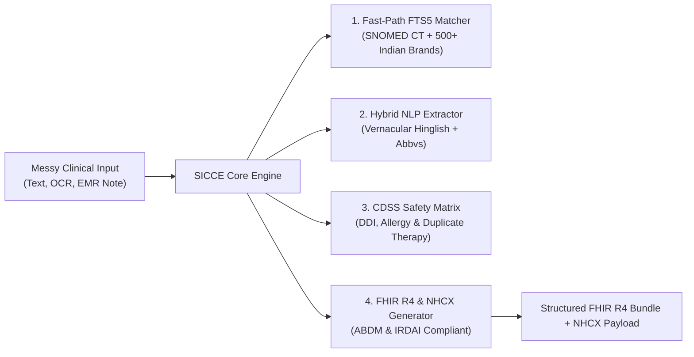

# SICCE: ABDM & NHCX Compliance Engine in a Box
### High-Performance Clinical Translation & Pre-Adjudication Middleware for Indian Healthcare Systems

---

## 🎯 Executive Summary

The **SNOMED-India Clinical Coding Engine (SICCE)** is a turnkey B2B middleware gateway designed specifically for Indian EMR / HIS vendors, diagnostic platforms, and Third-Party Administrators (TPAs). 

Instead of spending 6–12 months and millions of rupees engineering custom SNOMED CT terminology servers, ABDM M1/M2 FHIR R4 pipelines, and NHCX insurance claim validators, engineering teams integrate SICCE in **less than an afternoon** via a single unified API.

---

## ⚡ The Problem SICCE Solves

1. **Messy Clinical Input**: Indian doctor prescriptions are heavily abbreviated ("*Tab Dolo 650 BD*", "*APD+*", "*SOBOE*") and mixed with vernacular phrases ("*khansi aur bukhar*", "*saas phoolna*"). Standard NLP models fail or hallucinate.
2. **ABDM Milestone 1 & 2 Mandates**: The National Health Authority (NHA) requires all EMRs to emit standardized FHIR R4 OP Consultation records bound to verified SNOMED CT concepts and ABHA identifiers.
3. **NHCX Claim Rejections**: Up to 35% of cashless health insurance claims face queries or outright rejections due to ICD-10 medical necessity mismatches, unvalidated dosage limits, and unmapped brand names.

---

## 🏗️ Architecture & Core Capabilities



- **Sub-50ms Terminology Lookups**: Powered by local SQLite FTS5 with phonetic indexing across 100,000+ SNOMED CT concepts and 500+ top Indian pharmaceutical brands (e.g. *Pan-D*, *Augmentin 625*, *Telma 40*).
- **Zero-Hallucination Guarantee**: Uncoded terms log honestly with standard fallbacks rather than inventing fake codes.
- **Embedded CDSS Safety Engine**: Real-time evaluation of Drug-Drug Interactions (DDIs), Penicillin cross-allergies, and duplicate therapy risks before claim dispatch.
- **Pre-Adjudication Scoring**: Analyzes FHIR claim bundles against IRDAI OPD sub-limits, provider registry checks, and medical necessity coherence to maximize auto-approval rates.

---

## 💰 Commercial Pricing Tiers

| Tier | Monthly Investment | Scope & Capacity | Ideal For |
| :--- | :--- | :--- | :--- |
| **Developer Sandbox** | **Free (₹0)** | 100 calls/day, full documentation, watermarked output | Evaluation & integration testing |
| **Pilot Partnership** | **₹25,000 / month** | Up to 25,000 calls/mo, dedicated Slack support, customized brand dictionary | EMR/HIS pilot deployments (3-month sprint) |
| **Production Scale** | **₹50,000 – ₹1,00,000 / mo** | Unlimited volume, 99.9% uptime SLA, on-prem Docker profile available | Commercial EMR vendors & TPAs |

---

## 🚀 5-Minute Integration Example

```python
import httpx

response = httpx.post(
    "https://snomed-ct-parser-1.onrender.com/api/v1/parse",
    headers={"X-API-KEY": "your-api-key"},
    json={"text": "Pt c/o severe sar dard aur bukhar x 2 days. APD positive. Tab Pantocid 40mg OD, Tab Dolo 650mg BD."}
)

clinical_bundle = response.json()
# Returns structured ABDM FHIR R4 bundle + CDSS safety evaluation + vernacular dosage schedules
```

---

## 📞 Partner With Us
- **Developer Sandbox**: `https://snomed-ct-parser-1.onrender.com`
- **Founder & Clinical Informatics Lead**: SICCE Core Engineering
- **Deployment Model**: Multi-tenant Managed Cloud or Air-Gapped On-Premises Docker
