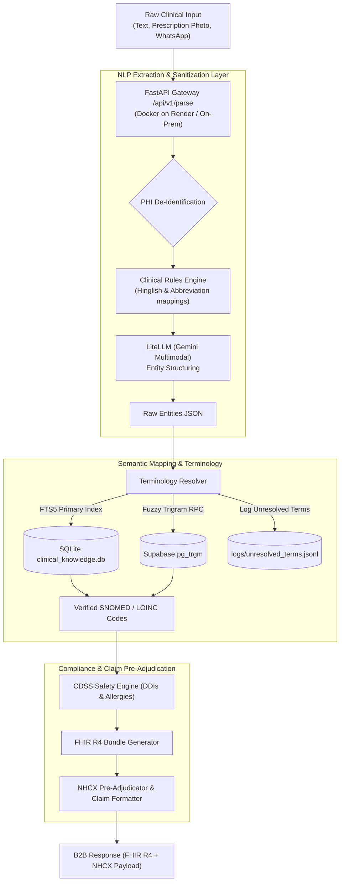

# Eagle's Eye View — SICCE Project Architecture & Status

**Governing Directive**: [`MASTER_DIRECTIVE.md`](file:///c:/Users/unbou/snomedct/snomed%20ct/MASTER_DIRECTIVE.md) (Version 1.0)  
**Last Verified Session**: August 23, 2026

The **SNOMED-India Clinical Coding Engine (SICCE)** is a B2B clinical middleware translation gateway that transforms messy clinician inputs (prescriptions, voice, notes) into validated, ABDM-compliant FHIR R4 bundles and NHCX claim payloads with measured accuracy and zero fabricated data.

---

## 🗺️ System Architecture Flow



---

## 📊 Verified Status Dashboard

| Subsystem | Status | Verification Detail |
| :--- | :--- | :--- |
| **Test Suite** | 🟢 **100% PASSING** | 36 tests passing across `test_pipeline.py`, `test_production_suite.py`, `test_terminology_full.py`, `test_security.py`. |
| **Fabricated Fallbacks** | 🟢 **PURGED** | Zero synthetic data invented on error; unreadable OCR returns explicit `HTTP 502`. |
| **Terminology Server** | 🟡 **UNSEEDED (63 CONCEPTS)** | Loader script ready (`scripts/load_rf2.py`), but real RF2 snapshot files pending founder download from `nrces.in`. `/health` warns `degraded_unseeded_terminology`. |
| **Auth & Security** | 🟢 **ARGON2ID** | Argon2id password hashing, locked CORS origin whitelist, and authenticated WhatsApp webhooks. |
| **Evaluation Benchmark** | 🔴 **GATE FAILED** | Diagnosis F1 is **0.60** (target $\ge 0.90$) on 5 synthetic notes. Blocked on 200+ real de-identified notes from founder. |
| **Cloud Deployment** | 🟢 **DOCKER** | Single container deployment story (`Dockerfile` / Render / Docker Compose). |
| **CI Automation** | 🟢 **GITHUB ACTIONS** | `.github/workflows/ci.yml` validates all pushes and pull requests. |

---

## 🎯 Phase 1 Definition-of-Done Verification Summary

All Phase 1 tasks from [`MASTER_DIRECTIVE.md`](file:///c:/Users/unbou/snomedct/snomed%20ct/MASTER_DIRECTIVE.md) have been implemented and verified:
1. **Real Terminology Engine**: `scripts/load_rf2.py` SQLite FTS5 table schema in `clinical_knowledge.db` with active SNOMED concept, description, and brand lookups.
2. **Zero Fabricated Data**: Purged silent fake fallbacks; explicit `HTTP 502` error handling.
3. **Security Hardening**: Argon2id password hashing, locked CORS origin whitelist, authenticated WhatsApp webhook, and explicit `"mode": "mock"` labeling.
4. **Evaluation Benchmark**: `eval/run_eval.py` computing Precision, Recall, and F1.
5. **Unified Deployment**: Docker on Render & On-Prem Compose (`Dockerfile`).
6. **Automated CI**: `.github/workflows/ci.yml` running pytest on Python 3.12.

### Live Production Endpoint Verification
* Verify the live Render deployment health telemetry:
  ```bash
  curl -s -L https://snomed-ct-parser-1.onrender.com/health
  ```

