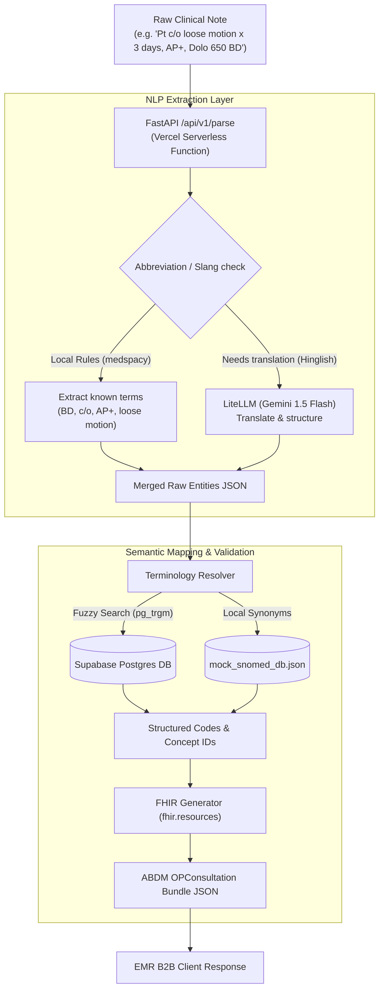

# Eagle's Eye View — SICCE Project status

The **SNOMED-India Clinical Coding Engine (SICCE)** is designed to act as a secure, lightning-fast B2B middleware translation gateway. It bridges messy clinician notes (including Hinglish and abbreviations) to official, ABDM-compliant FHIR R4 bundles.

---

## 🗺️ System Architecture Flow

Here is how data travels through the engine from clinician entry to government-compliant JSON:



---

## 📊 Current Status Dashboard

| Layer | Status | Details |
| :--- | :--- | :--- |
| **Local Codebase** | 🟢 PASSING | 5 core unit tests run and pass perfectly in 0.2s locally. |
| **FastAPI Backend** | 🟢 FUNCTIONAL | Code is fully structured and includes key auth, rate limits, and health endpoints. |
| **Vercel Hosting** | 🟡 DEPLOYING | Bypassing cloud build timeouts by uploading a prebuilt local package. |
| **Supabase DB** | 🔴 SCHEMA MISSING | Connection works, but tables & fuzzy functions need to be created via SQL editor. |
| **GitHub Repo** | 🟢 CONNECTED | Staged, committed, and pushed latest configurations to `origin/main`. |

---

## 🚀 Step-by-Step Implementation Roadmap

```mermaid
gantt
    title Deployment & Validation Checklist
    dateFormat  YYYY-MM-DD
    section Phase 1: API Setup
    Set Vercel Env Variables           :done,    des1, 2026-07-10, 1d
    Deploy prebuilt package to Vercel  :active,  des2, 2026-07-10, 1d
    section Phase 2: Database Setup
    Run supabase_schema.sql in Editor  :todo,    des3, after des2, 1d
    section Phase 3: Integration
    Verify API Health endpoint         :todo,    des4, after des3, 1d
    Test live clinical note curl       :todo,    des5, after des4, 1d
```

### 1. Vercel Deployment (In Progress)
* **What we did**: Configured `SUPABASE_URL`, `SUPABASE_KEY`, `API_KEYS`, `GEMINI_API_KEY`, and `LLM_MODEL` on Vercel.
* **Why we did it locally**: The Python bundle size is **437.76 MB** due to heavy machine learning libraries (`medspacy`/`spacy`). Cloud compilers timed out, so we ran a local `vercel build --prod` and are uploading the prebuilt outputs.

### 2. Supabase Seeding (Next Step)
* **Action Required**: Log in to your [Supabase Dashboard](https://supabase.com) for project `lwueqpgacqpkgagcgrfb`.
* Go to **SQL Editor** -> Create New Query -> Paste the entire contents of [supabase_schema.sql](file:///home/sucharithpop/Downloads/snomed%20ct/supabase_schema.sql) -> Click **Run**.
* This initializes the SNOMED mock tables and sets up the pg-trigram index logic.

### 3. API Verification (Final Step)
* Once the DB is seeded and Vercel finishes deployment, verify the public health endpoint:
  ```bash
  curl -s -L https://snomed-ct-apexs-projects-3d0f841e.vercel.app/health
  ```
  *Expected Output*: `"supabase_db": "configured"` (instead of `"local_mock_mode"`).
