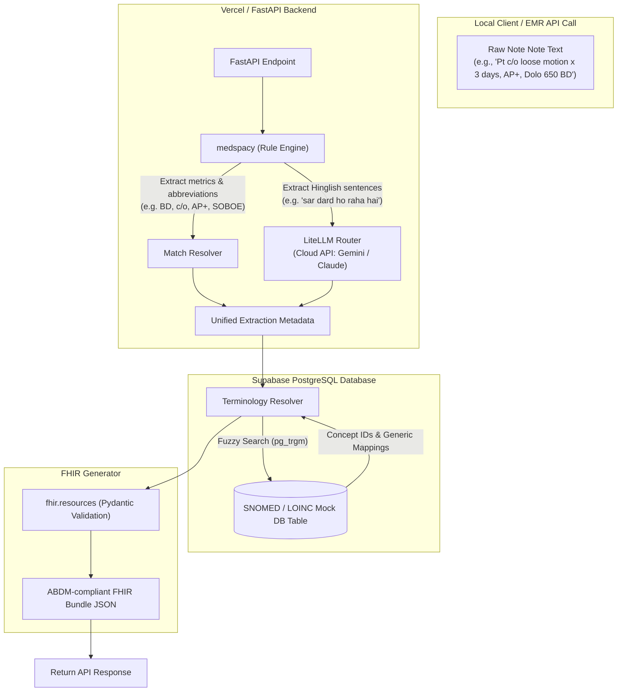

# Implementation Plan - SICCE Prototype (General Medicine OPD Focus)

Prototyping the core pipeline for the **SNOMED-India Clinical Coding Engine (SICCE)**. This plan designs a cloud-native, open-source stack that processes clinical Hinglish and abbreviation text, resolves terminologies using a fuzzy-search database, and outputs official ABDM-compliant FHIR R4 bundles.

---

## 🎯 The "Clinical Wedge" Strategy

To out-compete generic AI models, we are building this prototype to be the absolute, undisputed champion of a single niche: **General Medicine Outpatient Department (OPD) and Emergency Ward notes**.

We will train our extraction engine to recognize the exact shorthand, abbreviations, and Hinglish clinical slang used by Indian general medicine physicians:

* **Abbreviations:** `SOBOE` (Shortness of Breath on Exertion), `pedal edema +`, `c/o` (complaining of), `h/o` (history of), `AP+` (Abdominal Pain positive), `BD/OD/TDS` (dosage frequencies).
* **Hinglish/Colloquialisms:** *loose motion*, *sar dard* (headache), *ulti jaisa lag raha hai* (nausea), *jalan in chest* (heartburn/dyspepsia).
* **Brand to Generic Mappings:** *Dolo 650* -> *Paracetamol 650mg*, *Pantocid 40* -> *Pantoprazole 40mg*, *Lasix 40mg* -> *Furosemide 40mg*.

---

## Architecture Overview



---

## User Review Required

> [!IMPORTANT]
> **Supabase 500 MB Free Tier Constraint:**
> The complete global SNOMED CT database (plus trigram indexes) takes up **1.5 GB to 2.5 GB**, which exceeds the Supabase Free Tier limit of **500 MB**.
>
> - **Phase 1 (Mock):** We will use `mock_snomed_db.json` locally and on a free Supabase instance.
> - **Phase 2 (Production):** Once your MLDS license is approved, we will NOT import the raw RF2 files directly to the cloud. Instead, we will write a local python extraction script to generate a **localized Reference Set (RefSet)** containing only the top 10,000 terms relevant to Indian general medicine and AYUSH. This subset will easily fit under the 500 MB limit, keeping cloud costs at **$0**.

---

## Proposed Changes

We will build the prototype locally in your workspace: `/home/sucharithpop/Downloads/snomed ct` and prepare it for GitHub deployment.

### 1. Database & Dictionary Component

We will create a structured terminology seed file containing general medicine concepts, synonyms, Hinglish slang, and drug mappings.

#### [NEW] [mock_snomed_db.json](<file:///home/sucharithpop/Downloads/snomed%20ct/mock_snomed_db.json>)

* Contains standard English names, synonyms, Hinglish terms, and drug brand-to-generic mappings (e.g. *Dolo 650* -> *Paracetamol 650mg*).
* Includes specific nodes for our clinical wedge: `SOBOE` (SNOMED: 60845006), `pedal edema` (SNOMED: 30711000), `loose motion` (SNOMED: 62315008), etc.

#### [NEW] [supabase_schema.sql](<file:///home/sucharithpop/Downloads/snomed%20ct/supabase_schema.sql>)

* SQL script to initialize the Postgres table on Supabase.
* Enables the `pg_trgm` (trigram) extension and indexes the search terms for fast, fuzzy clinical query matching.

---

### 2. Clinical NLP Parser Component

We will implement a hybrid extraction parser using `medspacy` and `LiteLLM`.

#### [NEW] [nlp_parser.py](<file:///home/sucharithpop/Downloads/snomed%20ct/nlp_parser.py>)

* Rules engine using `spaCy` to process clinician shortcuts (*BD*, *OD*, *c/o*, *h/o*, *APD*, *B/L AGE*, *SOBOE*, *pedal edema +*).
* LLM parser using `LiteLLM` to clean up mixed-language (Hinglish/local slang) clinical entities.

---

### 3. Terminology Resolver Component

We will write the matching logic to lookup terms against the Supabase database.

#### [NEW] [terminology_resolver.py](<file:///home/sucharithpop/Downloads/snomed%20ct/terminology_resolver.py>)

* Connects to Supabase.
* Performs SQL trigram-based fuzzy searches to match extracted entities to exact SNOMED Concept IDs, LOINC codes, and AYUSH terms.

---

### 4. ABDM FHIR Generator Component

We will construct the final JSON payload using official FHIR models.

#### [NEW] [fhir_generator.py](<file:///home/sucharithpop/Downloads/snomed%20ct/fhir_generator.py>)

* Uses `fhir.resources` (Pydantic) models to structure `OPConsultRecord` bundles.
* Automatically validates fields, data types, and terminologies against the NHA (National Health Authority) standards.

---

### 5. API & Entrypoint Component

We will wrap the pipeline in a FastAPI server.

#### [NEW] [main.py](<file:///home/sucharithpop/Downloads/snomed%20ct/main.py>)

* FastAPI web app exposing a `POST /api/v1/parse` endpoint.
* Accepts raw clinical text and outputs the validated FHIR R4 JSON bundle.

#### [NEW] [requirements.txt](<file:///home/sucharithpop/Downloads/snomed%20ct/requirements.txt>)

* Declares standard python requirements (`fastapi`, `uvicorn`, `medspacy`, `fhir.resources`, `litellm`, `supabase`, `psycopg2-binary`).

#### [NEW] [vercel.json](<file:///home/sucharithpop/Downloads/snomed%20ct/vercel.json>)

* Configuration to deploy the FastAPI serverless functions on Vercel.

---

## Verification Plan

### Automated Tests

* Standard test suite to verify extraction correctness, database connectivity, and FHIR outputs.

```bash
python3 -m unittest discover -s tests
```

### Manual Verification

* Deploy backend to Vercel, upload mock database to Supabase.
* Run local cURL request sending:
  ```json
  {
    "text": "Pt c/o loose motion x 3 days, AP+, Dolo 650 BD"
  }
  ```
* Verify that the response returns HTTP 200 with a fully structured and validated ABDM FHIR JSON bundle.
