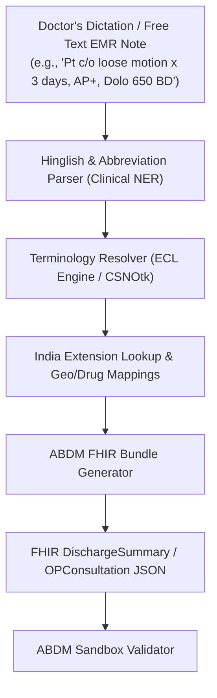
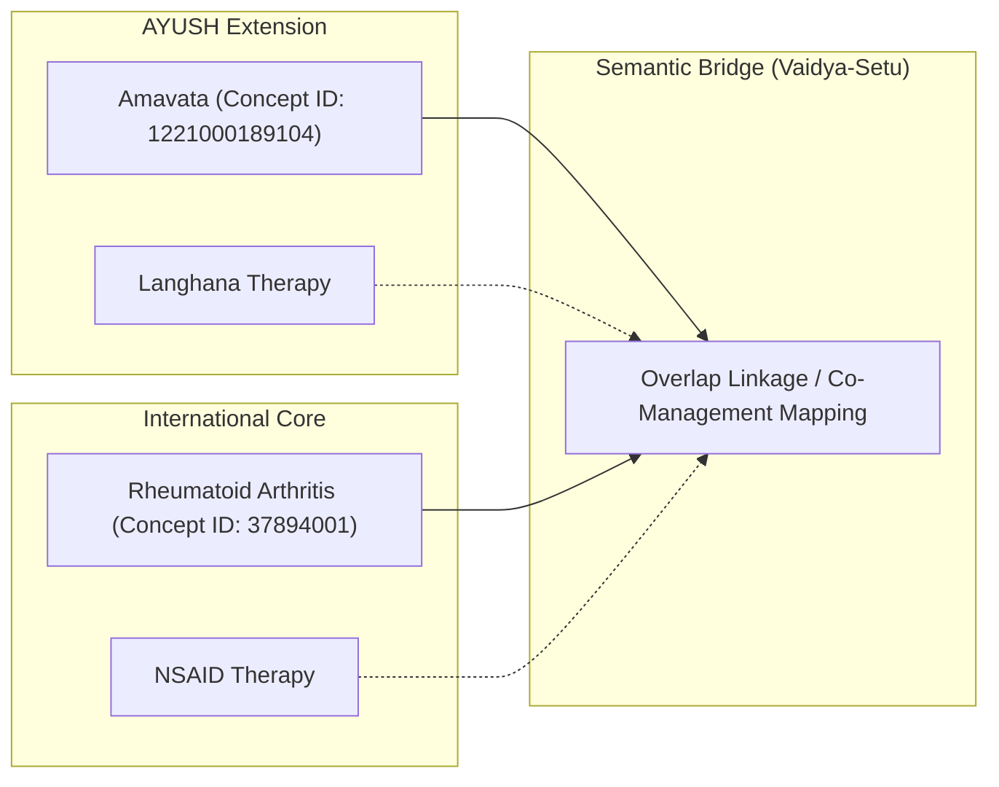

# SNOMED CT & ABDM Health-Tech Project Proposals (India Context)

As a physician transitioning into health-tech, you possess a unique superpower: **clinical domain expertise coupled with software engineering skills**. You understand the administrative and cognitive burdens doctors face, as well as the technical structures required for semantic interoperability. 

In India, the **Ayushman Bharat Digital Mission (ABDM)** has mandated **HL7 FHIR R4** for data exchange and **SNOMED CT, LOINC, and ICD-10** for semantic coding. However, a major gap exists between policy mandates and clinical realities.

Below are three highly innovative, prestigious, and career-defining project proposals designed to solve real-world problems in Indian healthcare. Implementing any of these will place you at the forefront of the health-tech transition, and would be highly appreciated by C-DAC (NRCeS), the National Health Authority (NHA), and SNOMED International.

---

## 🗺️ Project Landscape Matrix

| Project | Target Problem | Core Tech Stack | Primary Stakeholder | Career Showcase |
| :--- | :--- | :--- | :--- | :--- |
| **1. SICCE**  *(Recommended)* | Point-of-Care Coding & Hinglish/Abbreviation Parsing | Clinical NLP (spaCy/HuggingFace), Local Terminology Server, ABDM FHIR APIs, C-DAC DISB | NHA (ABDM), EMR Developers, Allopathic Clinics | Machine Learning, NLP, FHIR Standards, Enterprise Architecture |
| **2. Vaidya-Setu** | Integrative Medicine & cross-system mapping | Ontology Mapping, RDF/Graph DB, Drug Interaction Engine, AYUSH SNOMED Extension | Ministry of AYUSH, Integrative Hospitals | Ontological Engineering, Knowledge Graphs, Clinical Safety |
| **3. Pragmatic-RefSets**| Terminology bloat & Rural PHC UI design | Text Clustering, Semantic Web, Dynamic UI Generation, CSNOtk SDK | State Health Departments, Rural PHCs | Product Engineering, UX/UI, Health Informatics, Data Science |

---

## Project 1: SICCE (SNOMED-India Clinical Coding Engine)
> **Tagline:** *Real-time parsing of mixed-language (Hinglish) clinical narratives into structured, ABDM-compliant FHIR bundles.*

### The Problem
Doctors in India will not search through a hierarchy of 350,000+ codes to log a diagnosis or symptom. Instead, they write or dictate rapid, unstructured notes containing:
1. **Multilingual mixed-language (Hinglish):** e.g., *"sar dard x 2 days"* (Headache) or *"pet kharab hai"* (Diarrhea).
2. **Non-standard Indian clinical abbreviations:** e.g., *APD* (Acid Peptic Disease), *B/L AGE* (Bilateral Acute Gastroenteritis), *c/o* (complaining of), *AP+* (Abdominal Pain Positive).
3. **Local Brand Names:** e.g., prescribing *"Dolo-650"*, *"Pantocid"*, or *"Montek-LC"* instead of recording the generic molecule.

Because of this, current ABDM implementations upload scanned PDFs or FHIR bundles with *un-coded* free text in the `.display` field, rendering patient data useless for automated clinical decision support or research.

### Proposed Solution (Your Project)
An open-source NLP middleware API and lightweight UI widget that:
* **Parses unstructured medical text** containing Indian idioms, abbreviations, and brand names.
* **Maps extracted concepts to SNOMED CT and LOINC codes** using a locally hosted instance of C-DAC's **CSNOtk** (C-DAC’s Toolkit for SNOMED CT) or a Snowstorm terminology server.
* **Resolves local drug brands** to generic clinical drug concepts using the **C-DAC Drug Information Service Bundle (DISB)** APIs.
* **Generates a structured HL7 FHIR R4 OPConsultation Bundle** containing:
  * `Condition` resources (fully coded with SNOMED CT).
  * `Observation` resources (fully coded with LOINC).
  * `MedicationRequest` resources (fully coded with standard terminologies).
* **Validates the bundle** against the official ABDM FHIR Profile.

### Implementation Blueprint
1. **Clinical NER Model:** Use spaCy's `EntityRuler` or fine-tune a small transformer (like ClinicalBERT) using a custom rule-based dictionary of Indian medical abbreviations and Hinglish terminology mapping.
2. **Database Integration:** Download and run the SNOMED CT India Release (with Indian Reference Sets) inside a local instance of C-DAC's CSNOtk SDK.
3. **Expression Constraint Language (ECL) Querying:** Write precise ECL queries to constrain search spaces (e.g., constraining symptoms to `< 413350009 |Finding with explicit trigger|` or diseases to `< 404684003 |Clinical finding|`).
4. **FHIR Serialization:** Use Java (HAPI FHIR) or Python (`fhir.resources` package) to map the parsed JSON metadata into official ABDM FHIR profiles.

### Why this makes you shine
This solves the **actual bottleneck** of the Ayushman Bharat Digital Mission. You demonstrate that you can take messy, real-world clinician input and transform it into interoperable, clean clinical data. SNOMED International and C-DAC would highly appreciate this because it makes their terminology *usable* at the point of care.

---

## Project 2: Vaidya-Setu (Integrative Medicine Terminology Bridge)
> **Tagline:** *A dual-ontology semantic engine mapping the India AYUSH SNOMED CT Extension to Allopathy.*

### The Problem
The Ministry of AYUSH has released the **India AYUSH Extension for SNOMED CT** to standardize clinical terms in Ayurveda, Siddha, Unani, and Homeopathy. However, traditional medicine and western medicine remain digitally siloed. 
* There is no semantic bridge linking AYUSH codes to Allopathic codes.
* If a patient is diagnosed with *Amavata* (Ayurvedic concept) and later visits an allopathic clinic, the EMR does not recognize this as overlapping with *Rheumatoid Arthritis* (Allopathic concept).
* There is no warning mechanism for **Herb-Drug Interactions** (e.g., combining Ayurvedic formulations containing *Guggulu* with allopathic anticoagulants, which increases bleeding risks).

### Proposed Solution (Your Project)
A clinical terminology mapping and safety framework that:
* **Bridges AYUSH and Allopathic Terminologies:** Maps codes from the SNOMED India AYUSH Extension to corresponding Allopathic SNOMED CT concepts, defining relationships like `co-managed_with`, `symptomatically_similar_to`, or `therapeutically_linked_to`.
* **Herb-Drug Interaction (HDI) Engine:** Map Ayurvedic formulations (which are represented by codes in the AYUSH extension) to their active chemical ingredients, and check them against standard drug databases (like RxNorm or SNOMED Medication hierarchies) to flag interactions.
* **Integrative FHIR Timeline:** Create an interactive, patient-centric visual timeline that merges AYUSH and Allopathy records into a single clinical dashboard under a unified FHIR profile.

### Implementation Blueprint
1. **Ontological Mapping Database:** Build a Neo4j graph database containing both standard SNOMED CT hierarchies and the India AYUSH Extension. Define custom relationships between nodes.
2. **API Layer:** Build a REST API using FastAPI (Python) that allows an EMR to query a patient's AYUSH diagnosis code and retrieve matching Allopathic clinical pathways, and vice-versa.
3. **Safety Engine:** Standardize the ingredients of the top 50 common Ayurvedic formulations (like Ashwagandha, Triphala, Guggulu) into SNOMED substance codes and LOINC attributes. Compile a rule-based safety dictionary to trigger alerts when co-prescribed with mainstream drugs.

### Why this makes you shine
Integrative medicine is a massive priority for the Indian government (Ministry of AYUSH). By writing the first open-source tool that semantically connects traditional Indian systems of medicine with modern allopathic databases, you establish yourself as a pioneer in a highly specialized, globally unique subdomain of medical informatics.

---

## Project 3: Pragmatic-RefSets (PHC Archetype & Dynamic UI Generator)
> **Tagline:** *Automated generation of localized epidemiological RefSets and simplified EMR interfaces for rural Indian primary care.*

### The Problem
SNOMED CT contains over 350,000 concepts. For a community nurse or doctor at a rural Primary Health Centre (PHC) in India, 95% of patients present with one of 150 local conditions (e.g., specific vector-borne diseases like Dengue/Malaria, maternal conditions, local agricultural chemical poisonings, or snakebites). 
Navigating the entire SNOMED catalog is slow and causes database bloat. Furthermore, generic EMR templates fail to adapt to local epidemiological variations (e.g., a PHC in West Bengal deals with different vector-borne patterns than a PHC in Rajasthan).

### Proposed Solution (Your Project)
A tool that automatically analyzes historical PHC records to generate localized clinical RefSets and dynamically constructs the EMR user interface:
* **Epidemiological Parser:** Ingests local historical clinic registers (often in CSV format) and automatically maps free-text diagnoses to candidate SNOMED CT concepts.
* **Refset Builder:** Clusters these terms to generate a localized **SNOMED CT Reference Set (RefSet)** and **FHIR ValueSets** optimized for that specific facility.
* **Dynamic Form Generator:** Outputs a lightweight, mobile-friendly React/HTML web form that dynamically loads *only* the codes inside the localized RefSet. A doctor can document an entire outpatient visit with just 3 to 4 taps.

### Implementation Blueprint
1. **Concept Clustering:** Build a Python script using pandas and scikit-learn to cluster local text diagnoses, using TF-IDF or text embeddings, then map the clusters to SNOMED concepts using C-DAC's CSNOtk explore APIs.
2. **Reference Set Exporter:** Programmatically generate the SNOMED RF2 (Release Format 2) Reference Set files, complying with the SNOMED International specification.
3. **Dynamic Frontend UI:** Build a React application that fetches the generated RefSet JSON and dynamically renders auto-complete dropdowns and checklists, ensuring rapid data entry for the clinician.

---

## 🚀 Recommendation & Next Steps

> [!IMPORTANT]
> **We recommend pursuing Project 1: SICCE (SNOMED-India Clinical Coding Engine).** 
> It directly solves the most pressing challenge of ABDM adoption: **transforming unstructured clinician text into interoperable data without changing the doctor's workflow**.

### How this project builds your career:
1. **Clinical Legitimacy:** You are using your background as a physician to construct a realistic clinical abbreviation and Hinglish dictionary, proving you understand clinical workflow limitations.
2. **Engineering Rigor:** You will integrate advanced NLP (Named Entity Recognition), Terminology servers (CSNOtk/Snowstorm), and data standardizations (HL7 FHIR R4).
3. **High Visibility:** An open-source prototype of this can be showcased to the **NHA (National Health Authority) sandbox team**, submitted to **C-DAC Pune**, and presented at conferences like the **SNOMED International Expo** or **AMIA (American Medical Informatics Association)**.

### Recommended MVP Tech Stack:
* **Backend:** Python + FastAPI (for high-speed async NLP processing).
* **NLP Library:** `spaCy` (specifically utilizing entity linking features) or `Hugging Face Transformers` for clinical NER.
* **Terminology Engine:** A local Docker instance of the **Snowstorm** terminology server or CDAC's **CSNOtk** DLLs/libraries.
* **FHIR Library:** `fhir.resources` (Python) to generate valid JSON payloads.
* **Frontend:** Next.js (Tailwind CSS) for a clean, minimalist clinical dashboard showcasing:
  1. *Input Panel:* Text box for clinician notes/dictation transcription.
  2. *Processing Panel:* Under-the-hood real-time mapping showing extracted entities and their resolved SNOMED CT and LOINC concept codes.
  3. *Output Panel:* Beautiful, copyable FHIR R4 JSON representation of the note.

---

### Clarifying Questions for You:
1. Which of these three projects (**SICCE**, **Vaidya-Setu**, or **Pragmatic-RefSets**) aligns closest with your immediate interest and technical comfort level?
2. Do you have access to any sample anonymized clinical notes, discharge summaries, or clinical registers from an Indian hospital that we can use to start building our NLP mapping dictionary? (If not, we can easily synthesize a representative dataset based on clinical knowledge).
3. Do you have experience with Python/NLP libraries, or would you prefer a Java/Javascript-based stack?
